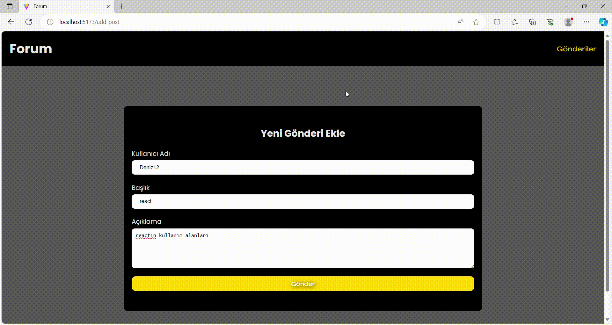

# Kütüphaneler

- axios
- react-router-dom
- json-server
- sass

# MVC (Model View Controller)

- Model: Uygulamanın veri mantığını veya yapısını temsil eder
- - Örneğin: Projede tutulacak statin yapısı burdda kurulur

- View: Son kullanıcnın gördüğü tasarım
- controller: View ile Model arasıdnaki bağlandıtyı sağalr ayrıca viewin dinamizmi burdan gelir

## 'Screen'

